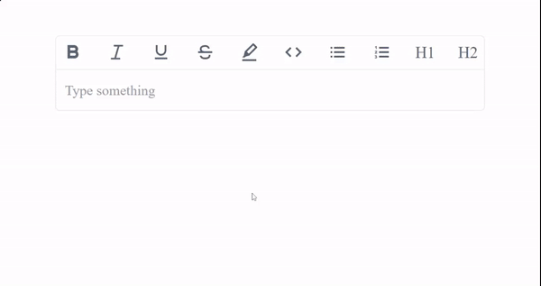

# cuvette-text-editor


A rich text editor for react, built over [draft.js](https://draftjs.org/)



---
## Installation and Usage

The easiest way to install cuvette-text-editor is to install it via npm -
`npm i cuvette-text-editor`

Then use it in you app -

```javascript
import React, { useState } from "react";

import Editor from "cuvette-text-editor";

function MyComponent(props) {
  const initialValue = props.defaultState;
  const [editorValue, setEditorValue] = useState(initialValue);

  return (
    <div>
      <Editor
        defaultValue={initialValue}
        onChange={(value) => setEditorValue(value)}
      />
    </div>
  );
}
```

and that's it, no need to import any external css nothing else. Just import and start using it.

---
## Props

These are the props we have -
| Prop Name            | Prop Type  | description                                                                                                                                                                         | example                                                                                                                                                                          |
| -------------------- | ---------- | ----------------------------------------------------------------------------------------------------------------------------------------------------------------------------------- | -------------------------------------------------------------------------------------------------------------------------------------------------------------------------------- |
| defaultState         | `string`   | sets the initial value of editor                                                                                                                                                    | `defaultValue={"{"blocks":[{"key":"2edjc","text":"Hey this is default value","type":"unstyled","depth":0,"inlineStyleRanges":[],"entityRanges":[],"data":{}}],"entityMap":{}}"}` |
| placeholder          | `string`   | sets the placeholder for editor                                                                                                                                                     | `placeholder={"Type something..."}`                                                                                                                                              |
| onChange             | `function` | fires when value of editor changes, contains the value in param                                                                                                                     | `onChange={(value)=>console.log(value)}`                                                                                                                                         |
| getPlaneTextOnChange | `function` | fires when value of editor changes, contains the value as readable text in param                                                                                                    | `getPlaneTextOnChange={(text)=>console.log(text)}`                                                                                                                               |
| readOnly             | `boolean`  | if `true` disables editing and hide toolbar , default- `false`                                                                                                                      | `readOnly={true}`                                                                                                                                                                |
| error                | `boolean`  | if `true` adds a red boundary around the editor showing some error in the entered value, default -`false`                                                                           | `error={true}`                                                                                                                                                                   |
| className            | `string`   | add class for the outer container of editor                                                                                                                                         | `className="my-new-class"`                                                                                                                                                       |
| errorClassName       | `string`   | add class for the outer container of editor when error prop is `true`                                                                                                               | `errorClassName="error-class"`                                                                                                                                                   |
| toolbarToBottom      | `boolean`  | shift the toolbar from top to bottom                                                                                                                                                | `toolbarToBottom={true}`                                                                                                                                                         |
| hideSeparator        | `boolean`  | removes the separator between toolbar and editor                                                                                                                                    | `hideSeparator={true}`                                                                                                                                                           |
| colors               | `object`   | specify the colors that can be used (allowed colors - _primary, error, options, code, highlight_)                                                                                   | `colors={{primary:"blue",highlight:"yellow",code:"red",error:"red",options:"brown"}}`                                                                                            |
| hiddenOptions        | `array`    | specify the options need to hide from toolbar (options - _bold, italic, highlight, code, underline, strikethrough, ordered-list-item, unordered-list-item, header-one, header-tow_) | `hiddenOptions={["header-one","unordered-list-item"]}`                                                                                                                           |


## Getting readable text

There are 2 ways of getting plane readable text - 

- By using `getPlaneTextOnChange` prop from `Editor` component

```javascript
    <Editor
      onChange={(state) => setEditorState(state)}
      getPlaneTextOnChange={text=>console.log('Got the readable text ->',text)}
    />
```

- By importing `getPlaneTextFromEditorState` from `cuvette-text-editor` 

```javascript
    
import Editor, { getPlaneTextFromEditorState } from "cuvette-text-editor";

function App() {
  const [editorState, setEditorState] = useState("");

  const handleClick = () => {
    const text = getPlaneTextFromEditorState(editorState);
    console.log("text ->", text);
  };

  return (
    <div className="App">
        <Editor
          onChange={(state) => setEditorState(state)}
        />
        
      <button onClick={handleClick}>Get plain text</button>
    </div>
  );
}
```